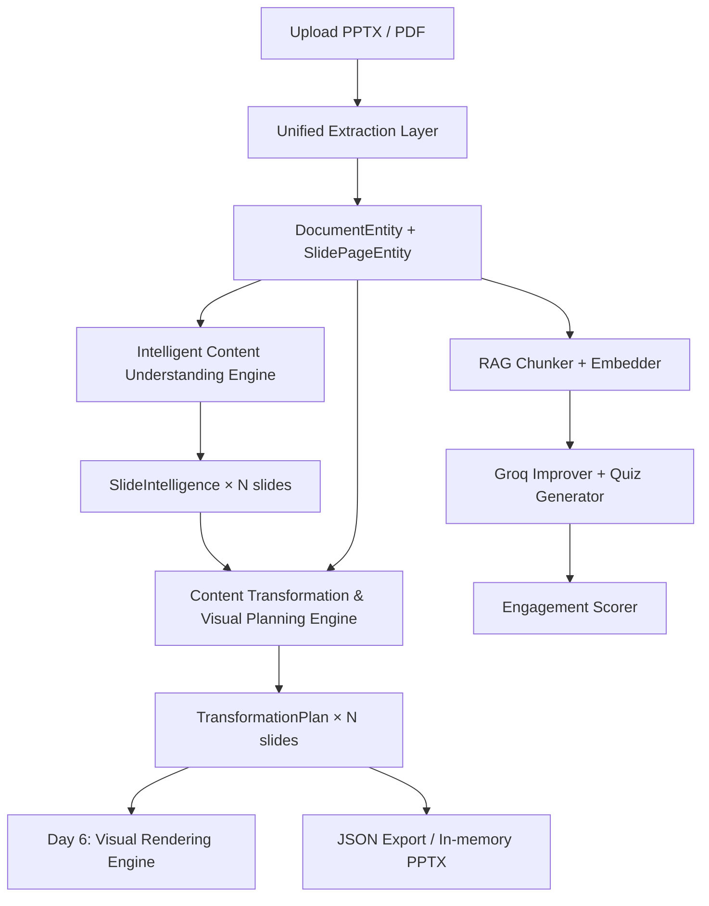

# 🎓 Learnova — AI Presentation Transformation Engine

> **Transforms boring, text-heavy PPTs/PDFs into modern, visually engaging, presentation-ready decks.**
> Uses AI-generated layouts, flowcharts, timelines, comparison tables, KPI cards, SmartArt, infographics, and professional visual structures — fully programmatic with optional Groq/Gemini AI integration.

---

## 🗺️ Production Sprint Status (Days 1–8)

| Day | Sprint Module | Status |
|-----|---------------|--------|
| Day 1 | **Project Planning & Research** — Finalized Learnova AI concept, problem statement, architecture & gap analysis | ✅ Complete |
| Day 2 | **Project Setup & Environment** — Directory structure, virtual environment, dependency integration, Git init | ✅ Complete |
| Day 3 | **PPT Parsing Engine** — Extraction of slide text, shapes, native tables, SmartArt, equations, and images | ✅ Complete |
| Day 4 | **PDF Parsing & Unified Pipeline** — PDF ingestion, PyMuPDF tables, embedded assets, scanned page OCR fallbacks | ✅ Complete |
| Day 5 | **Intelligent Content Understanding** — 20 slide responsibilities, 18 intent types, complexity scoring & text prioritization | ✅ Complete |
| Day 6 | **Content Transformation Logic** — Rules for paragraph summarization, text actions, flowcharts/tables/graphs mapping | ✅ Complete |
| Day 7 | **Layout & Design System Planning** — 10 curated design themes, visual specifications for 15 layout structures | ✅ Complete |
| Day 8 | **Current Progress & Subprocess Architecture** — Thread-safe subprocess PPTX/HTML builders, quiz interleaving, OCR fallbacks | 🔄 In Progress |

---

## 🚀 What Learnova Does

1. **Upload** a `.pptx` or `.pdf` file.
2. **Parse** all slide content — text blocks, tables, charts, SmartArt diagrams, equations, and embedded images via the Unified Extraction Layer.
3. **Understand** every slide using the Intelligent Content Understanding Engine — extract 20 types of structured knowledge (steps, definitions, statistics, comparisons, timelines, relationships, and more).
4. **Plan Transformations** — assign text actions (`KEEP`, `SUMMARIZE`, `REMOVE`, `MOVE_TO_VISUAL`, `MOVE_TO_NOTES`) and generate structured visual specifications for each slide.
5. **Improve** slide content with Groq AI.
6. **Generate quizzes** with Groq AI.
7. **Score** engagement quality per slide.
8. **Export** a redesigned `.pptx` deck (Day 6+).

---

## ✅ Current AI Stack

| Task | Model / Service |
|------|----------------|
| Slide Improvement | Groq `llama-3.1-8b-instant` |
| Quiz Generation | Groq `llama-3.1-8b-instant` |
| RAG Embeddings | Gemini `text-embedding-004` |
| PDF Vision Description | Gemini `gemini-1.5-flash` |
| Content Extraction / Classification / Planning | **Pure heuristics — zero LLM calls** |

> No OpenAI components are used anywhere in the active pipeline.

---

## 🏗️ Architecture Overview



---

## 📦 Sprint Deliverables

### Day 1–2 · Unified Extraction Layer

New strongly-typed `parsers/schema.py` with 8 production dataclasses:

| Class | Purpose |
|-------|---------|
| `TextBlockElement` | Paragraphs, headings, bullets with reading order |
| `TableElement` | Structured tables with headers and row grid |
| `VisualAssetElement` | Embedded images, icons, scanned pages |
| `StructuredChartElement` | Data-driven charts with series and categories |
| `DiagramElement` | Flowcharts, SmartArt, mindmaps with Mermaid export |
| `EquationElement` | OMML/MathML/LaTeX equations |
| `SlidePageEntity` | Root container per slide/page |
| `DocumentEntity` | Root document container |

Parsers:
- `parsers/ppt_parser.py` — Full PPTX extraction with SmartArt, grouped shapes, charts, equations, speaker notes
- `parsers/pdf_parser.py` — PyMuPDF text, page-level image extraction with size filtering

---

### Day 3 · RAG Preprocessing & AI Baseline

- `ai/improver.py` — Direct Groq SDK slide improvement (no LangChain)
- `ai/quiz_gen.py` — Direct Groq SDK quiz generation
- `rag/embedder.py` — Gemini `text-embedding-004` embeddings
- `rag/chunker.py` + `rag/retriever.py` — FAISS-backed semantic retrieval
- `utils/scorer.py` — Heuristic engagement scoring per slide

---

### Day 4 · Intelligent Content Understanding Engine

**Zero LLM. Pure programmatic extraction of 20 concept types per slide.**

Located in `intelligence/`:

| Module | Responsibility |
|--------|---------------|
| `concept_extractor.py` | 20-responsibility extractor: topic, learning objective, key concepts, definitions, facts, statistics, processes, comparisons, cause & effect, chronology, advantages, disadvantages, steps, examples, formulas, lists, FAQs, relationships |
| `content_classifier.py` | Maps slides to `PresentationIntent` enums (Process, Timeline, Comparison, Statistics, Hierarchy, Cycle, etc.) |
| `text_prioritizer.py` | Assigns `TextPriority` (HIGH / MEDIUM / LOW / DECORATIVE / REDUNDANT / REPEATED) to every text block |
| `visual_opportunity.py` | Detects 16 visual opportunity types with confidence scores and rationale |
| `complexity_scorer.py` | 0–10 complexity score mapped to Introductory / Intermediate / Advanced / Expert |
| `engine.py` | `SlideIntelligenceEngine` — orchestrates all sub-modules into a `SlideIntelligence` object |
| `schema.py` | All strongly-typed enums and dataclasses for the intelligence layer |

**Output: `SlideIntelligence` object per slide** — the single source of truth consumed by Day 5+.

Verification: `python3 verify_day4.py`

---

### Day 5 · Content Transformation & Visual Planning Engine

**No LLMs. Deterministic transformation planning from `SlideIntelligence` → `TransformationPlan`.**

Located in `intelligence/transformation.py`:

#### Text Actions

Every text block receives one of 6 actions with a stored reason:

| Action | Description |
|--------|-------------|
| `KEEP` | Retain as-is (title, key definition, critical fact) |
| `SUMMARIZE` | Compress to first sentence / 10 key words |
| `REMOVE` | Boilerplate, decorative, footer, redundant text |
| `MERGE` | Combine near-duplicate blocks |
| `MOVE_TO_VISUAL` | Replace with structured visual specification |
| `MOVE_TO_NOTES` | Move verbose detail to speaker notes |

#### Visual Specifications

Generates structured, production-ready specs for all 15 visual types:

| Spec Type | Contents |
|-----------|----------|
| `FlowchartSpecification` | nodes, edges, labels, start/end/decision nodes, orientation |
| `TimelineSpecification` | ordered events, dates, milestones |
| `ComparisonTableSpecification` | headers, rows, highlight columns, merge cells |
| `DecisionTreeSpecification` | branching nodes, conditions, outcomes |
| `HierarchySpecification` | root, levels, parent-child relationships |
| `CycleSpecification` | steps, direction, closed/open |
| `RoadmapSpecification` | phases, milestones, deliverables |
| `MatrixSpecification` | 4 quadrants, x/y axes |
| `KPICardSpecification` | metrics with value, label, trend |
| `ChecklistSpecification` | ordered task items with required flags |
| `OrganizationChartSpecification` | roles with reporting hierarchy |
| `IconGridSpecification` | concept-icon-explanation triples |
| `GraphSpecification` | graph type, axes, series, values |
| `InfographicSpecification` | layout type, multi-section blocks |
| `AIImageSpecification` | production-ready DALL-E/Imagen prompt: subject, style, composition, camera angle, educational purpose, visual emphasis, negative prompt |

#### `TransformationPlan` Schema

```json
{
  "slide_id": 2,
  "text_actions": {
    "<block_id>": {
      "original_text": "...",
      "action": "MOVE_TO_VISUAL",
      "reason": "Step-by-step procedural information moved into flowchart spec.",
      "transformed_text": null
    }
  },
  "visual_actions": [
    {
      "action_type": "REPLACE_TEXT_WITH_VISUAL",
      "target_opportunity": "Flowchart",
      "description": "...",
      "source_block_ids": ["s2_tb_0", "s2_tb_1"]
    }
  ],
  "visual_specs": [
    {
      "type": "Flowchart",
      "spec": {
        "nodes": [{"id": "step_1", "label": "Upload PPTX", "type": "process"}],
        "edges": [{"from": "step_1", "to": "step_2"}],
        "start_node": "step_1",
        "end_node": "step_4",
        "decision_nodes": ["step_3"],
        "recommended_orientation": "LR"
      }
    }
  ],
  "remaining_text": ["Slide Title"],
  "speaker_notes": "Focus learning objective: ...",
  "compression_statistics": {
    "original_word_count": 51,
    "target_word_count": 17,
    "compression_ratio": 0.333,
    "expected_readability_improvement": "90.0% improvement"
  },
  "confidence": 0.89
}
```

Verification: `python3 verify_day5.py` → exports `day5_transformation_plans.json`

---

## ⚙️ Setup & Installation

### Prerequisites
- Python 3.10+
- Gemini API key (for embeddings + image description)
- Groq API key (for slide improvement + quiz generation)

### 1. Clone
```bash
git clone https://github.com/yourusername/learnova.git
cd learnova
```

### 2. Create and activate venv
```bash
python -m venv venv

# macOS/Linux
source venv/bin/activate

# Windows
venv\Scripts\activate
```

### 3. Install dependencies
```bash
pip install -r requirements.txt
```

### 4. Configure environment
Create/update `.env` in the project root:

```env
GEMINI_API_KEY=your-gemini-key-here
GROQ_API_KEY=your-groq-key-here
```

### 5. Run app
```bash
streamlit run app.py
```

### 6. Run verification scripts
```bash
# Verify Day 4 — Intelligence Engine
python3 verify_day4.py

# Verify Day 5 — Transformation Planning Engine
python3 verify_day5.py
```

### 7. Run test suite
```bash
python3 -m pytest -v
# 20 passed, 2 skipped (parser integration — require real files)
```

---

## 📂 Project Structure

```text
learnova/
├── app.py                          # Streamlit frontend
├── logger.py
├── requirements.txt
├── verify_day4.py                  # Day 4 runtime verification
├── verify_day5.py                  # Day 5 runtime verification
├── day5_transformation_plans.json  # Sample output (auto-generated)
│
├── parsers/                        # Day 1–2: Unified Extraction Layer
│   ├── schema.py                   # 8 production dataclasses
│   ├── ppt_parser.py               # Full PPTX extraction
│   └── pdf_parser.py               # PyMuPDF text + image extraction
│
├── intelligence/                   # Day 4–5: Intelligence & Transformation
│   ├── schema.py                   # SlideIntelligence + enums
│   ├── engine.py                   # SlideIntelligenceEngine orchestrator
│   ├── concept_extractor.py        # 20-responsibility extractor
│   ├── content_classifier.py       # PresentationIntent classifier
│   ├── text_prioritizer.py         # TextPriority assignment
│   ├── visual_opportunity.py       # 16-type visual opportunity detector
│   ├── complexity_scorer.py        # 0–10 complexity scoring
│   └── transformation.py           # Day 5: TransformationPlan engine + 15 visual specs
│
├── ai/                             # Day 3: AI Modules
│   ├── improver.py                 # Groq slide improvement
│   ├── quiz_gen.py                 # Groq quiz generation
│   └── image_describer.py          # Gemini Vision image descriptions
│
├── rag/                            # Day 3: RAG Pipeline
│   ├── chunker.py
│   ├── embedder.py                 # Gemini text-embedding-004
│   └── retriever.py                # FAISS semantic retrieval
│
├── utils/
│   ├── scorer.py                   # Engagement quality scorer
│   └── ppt_builder.py              # In-memory themed PPTX export
│
├── tests/
│   ├── test_learnova.py
│   ├── test_intelligence.py        # Day 4 unit tests
│   └── test_transformation.py      # Day 5 unit tests
│
├── logs/
│   └── error.log
└── .env
```

---

## 🧰 Core Dependencies

| Package | Purpose |
|---------|---------|
| `streamlit` | Frontend UI |
| `python-pptx` | PPTX parsing and generation |
| `PyMuPDF` | PDF text and image extraction |
| `python-dotenv` | Environment variable management |
| `groq` | Groq LLM API (slide improvement, quizzes) |
| `google-genai` | Gemini embeddings + vision |
| `langchain-community` | LangChain compatibility layer |
| `faiss-cpu` | Vector similarity search |
| `pandas` | Data manipulation |
| `altair` | Chart rendering |
| `Pillow` | Image processing |

---

## 📝 Notes

- If Groq key/quota is invalid, slide improvement/quiz generation will fail gracefully.
- If Gemini quota is limited, image descriptions may be skipped; the text pipeline continues.
- The Intelligence Engine (Day 4) and Transformation Engine (Day 5) require **no API keys** — they run entirely on heuristics.
- PPT output is always generated in memory and returned as a downloadable buffer.
- `TransformationPlan` objects are the single source of truth consumed by the Day 6 Visual Rendering Engine.