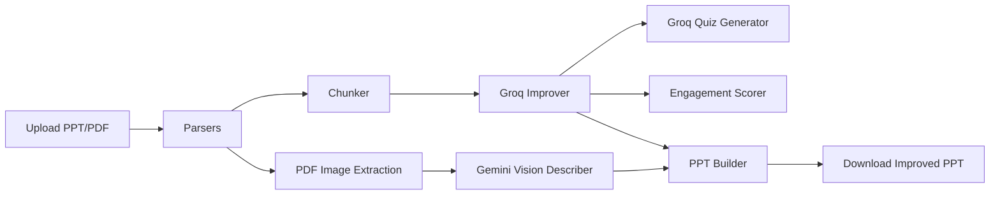

# 🎓 Learnova – AI Presentation Engine

Learnova turns static PPT/PDF content into teaching-ready slides with AI-driven improvements, quizzes, engagement analytics, and downloadable professional PPT output.

The app uses a Streamlit frontend with modular parsers, RAG preprocessing, AI generation modules, scoring utilities, and an export pipeline.

---

## ✅ Current AI Stack (Updated)

- Groq (`llama-3.1-8b-instant`) is used for:
  - Slide improvement
  - Quiz generation
- Gemini is used for:
  - Embeddings (RAG support)
  - PDF image description (Vision)

No OpenAI components are used in the active pipeline.

---

## 🚀 What Learnova Does

1. Upload a `.pptx` or `.pdf` file.
2. Parse slide/page text content.
3. Extract images from PDFs (with size filtering).
4. Chunk content for AI processing.
5. Improve slide content with Groq.
6. Generate quizzes with Groq.
7. Score engagement quality per slide.
8. Build and download a redesigned `.pptx` deck.

---

## 🆕 Recent Implementations

### 1) Groq Migration for Text Tasks
- `ai/improver.py` switched from Gemini LangChain calls to direct Groq SDK calls.
- `ai/quiz_gen.py` switched from Gemini LangChain calls to direct Groq SDK calls.
- Added `GROQ_API_KEY` support via `.env`.

### 2) PDF Image Processing + Vision Description
- `parsers/pdf_parser.py` now extracts per-page images using `page.get_images(full=True)` + `doc.extract_image(xref)`.
- Small images (<100x100) are skipped.
- Extracted image metadata now includes bytes, extension, and base64 payload.
- New module `ai/image_describer.py` describes images using the new `google-genai` SDK and `gemini-1.5-flash` with rate-limit spacing.
- Processing limit increased (`MAX_CHUNKS` scaled from 15 to 60) to handle large textbooks and dense PDFs.

### 3) Redesigned Downloadable PPT Output
- `utils/ppt_builder.py` now generates a modern themed deck:
  - Branded title slide.
  - Contextual two-column layout that naturally positions images beside text content.
  - Included an AI-generated image description caption embedded directly below the image.
  - Styled bullet hierarchy and highlighted takeaway card.
  - Closing “Thank You” slide.
- Output remains in-memory `BytesIO` (no disk writes).

### 4) UI Enhancements in Streamlit
- Improved slide tab displays images and descriptions when available.
- Download button exports the newly styled PPT.
- Visual theme and readability were polished for dashboard elements and captions.

---

## ⚙️ Setup & Installation

### Prerequisites
- Python 3.10+
- Gemini API key (for embeddings + image description)
- Groq API key (for slide improvement + quiz generation)

### 1. Clone
```bash
git clone https://github.com/yourusername/learnova.git
cd learnova
```

### 2. Create and activate venv
```bash
python -m venv venv

# Windows
venv\Scripts\activate

# macOS/Linux
source venv/bin/activate
```

### 3. Install dependencies
```bash
pip install -r requirements.txt
```

### 4. Configure environment
Create/update `.env` in the project root:

```env
GEMINI_API_KEY=your-gemini-key-here
GROQ_API_KEY=your-groq-key-here
```

### 5. Run app
```bash
streamlit run app.py
```

---

## 📂 Project Structure (Updated)

```text
learnova/
├── .streamlit/
│   └── config.toml
├── app.py
├── logger.py
├── requirements.txt
├── ai/
│   ├── improver.py           # Groq slide improvement
│   ├── quiz_gen.py           # Groq quiz generation
│   └── image_describer.py    # Gemini Vision image descriptions
├── parsers/
│   ├── ppt_parser.py
│   └── pdf_parser.py         # Text + image extraction (bytes/base64/ext)
├── rag/
│   ├── chunker.py
│   ├── embedder.py           # Gemini embeddings
│   └── retriever.py
├── utils/
│   ├── scorer.py
│   └── ppt_builder.py        # Redesigned themed PPT generation
├── tests/
│   └── test_learnova.py
├── logs/
│   └── error.log
└── .env
```

---

## 🧰 Core Dependencies

- `streamlit`
- `python-pptx`
- `PyMuPDF`
- `python-dotenv`
- `groq`
- `google-genai` (New Unified SDK)
- `langchain-community`
- `faiss-cpu`
- `pandas`
- `altair`
- `Pillow`

---

## 🛠 Processing Flow



---

## 📝 Notes

- If Groq key/quota is invalid, slide improvement/quiz generation will fail.
- If Gemini quota is limited, image descriptions may be skipped, but text pipeline can still run.
- PPT output is always generated in memory and returned as a downloadable buffer.