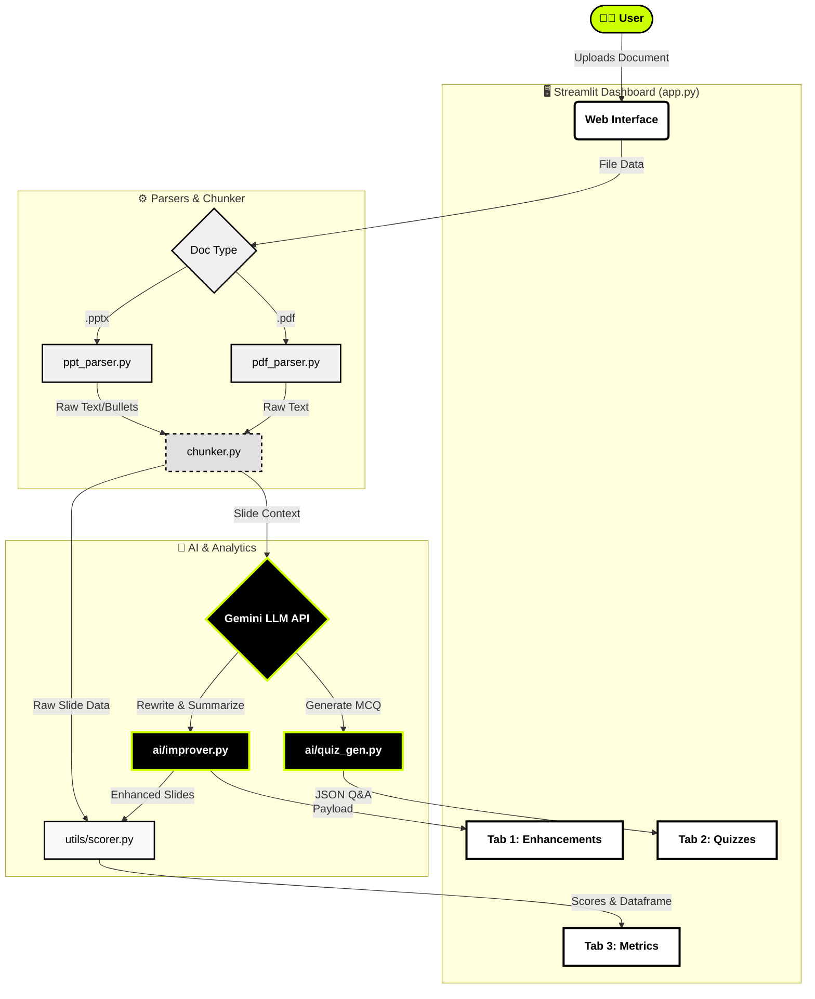
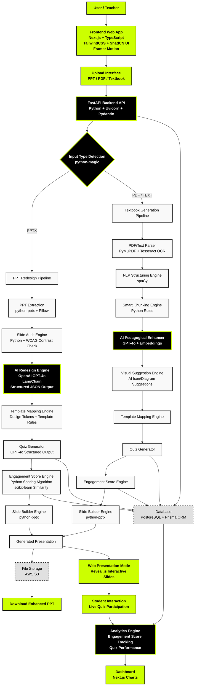

# 🎓 Learnova – AI Presentation Engine

Learnova is an intelligent, automated presentation enhancement and learning tool. It takes static presentation materials (PDFs or PowerPoint files), extracts their raw content, and leverages AI (Gemini) to seamlessly improve them, generate interactive quizzes, and evaluate their educational quality via an Engagement Score.

Built with a bold **Neobrutalist** design language, Learnova provides an intuitive, highly visual dashboard for educators, students, and presenters.

---

## 🚀 What the Project Does

1. **Document Parsing**: Users seamlessly upload educational materials (PPTX or PDF).
2. **AI Extraction & Chunking**: The internal RAG (Retrieval-Augmented Generation) engine chunks the parsed content into logical slide-level data.
3. **Gemini AI Improvement**: An AI improver processes the raw text to generate an optimized presentation structure, extracting clear takeaways, better bullet points, and speaker notes.
4. **Automated Quiz Generation**: For each chunk of content, an AI quiz generator automatically formulates multiple-choice questions to test the learner's understanding.
5. **Engagement Scoring**: An algorithmic scorer evaluates each slide based on metrics like text density, readability, bullet counts, title quality, and the presence of takeaways, outputting a dynamic dashboard and visualizations.

---

## ⚙️ Setup & Installation

### Prerequisites
- Python 3.9+ 
- Get a Gemini API key from [Google AI Studio](https://aistudio.google.com/)

### 1. Clone the repository
```bash
git clone https://github.com/yourusername/learnova.git
cd learnova
```

### 2. Set up Virtual Environment
```bash
# Create virtual environment
python -m venv .venv

# Activate on Windows:
.venv\Scripts\activate
# Activate on Mac/Linux:
source .venv/bin/activate
```

### 3. Install Dependencies
```bash
pip install -r learnova/requirements.txt
```

### 4. Configure Environment Variables
Create a `.env` file in the root folder (`d:\IPD_Project\.env`) and add your Gemini API key:
```env
GEMINI_API_KEY="your_api_key_here"
```

### 5. Run the Application
```bash
streamlit run learnova/app.py
```

---

## 🛠 Flow & Architecture



---

## 📂 Project Structure & File Breakdown

The project follows a modular structure isolating the UI from backend AI processing, parsing, and scoring mechanics.

```text
learnova/
├── .streamlit/
│   └── config.toml          # Streamlit UI theme configurations (light theme, primary color overrides)
├── app.py                   # 🟢 Main application entry point: Dashboard layout, Streamlit UI, state management, and custom CSS
├── logger.py                # System-wide logging utilities
├── requirements.txt         # Project dependencies
├── ai/
│   ├── improver.py          # AI integration: Calls Gemini to re-write, summarize, and improve slide chunks
│   └── quiz_gen.py          # AI integration: Calls Gemini to generate multiple-choice quizzes from context
├── parsers/
│   ├── pdf_parser.py        # Extracts text and structure from PDF documents
│   └── ppt_parser.py        # Extracts text, bullet points, and hierarchy from PPTX files
├── rag/
│   ├── chunker.py           # Organizes raw parsed document data into logical sequence/sizes
│   ├── embedder.py          # Embedding scripts for processing chunked content
│   └── retriever.py         # Retrieves relevant slide contents contextually
├── utils/
│   └── scorer.py            # Custom algorithm for engagement scores (Heuristics: density, readability, title quality)
└── tests/
    └── test_learnova.py     # Unit testing suite
```

---

## 🧰 Libraries & Frameworks Used

- **Frontend & UI**:
  - `Streamlit` - The core web framework running the dashboard.
  - `Altair` & `Pandas` - Data visualization and manipulation, powering the Engagement Score charts and data tables.
  - Custom HTML/CSS - Used for Neobrutalist design styling (Neon green `#ccff00`, bold black borders, customized dot-cursors).
- **Backend & AI**:
  - `google-generativeai` (Gemini API) - Core LLM engine driving the slide improvements and quiz generation.
  - `python-dotenv` - Managing environment variables and API keys safely.
- **Data Parsing** *(Assumed via module names)*:
  - `python-pptx` - For PPTX ingestion.
  - `PyMuPDF` / `PyPDF2` / `pdfplumber` - For PDF text extraction.

---

## 🚧 Current Progress: What Has Been Made So Far

### **Completed Features:**
✅ **Custom Theming & Navigation:** Distinctive neobrutalist UI (`app.py`), sidebar integration, interactive tabs, custom cursors, and responsive layouts.
✅ **File Upload Pipeline:** Integration for drag-and-drop document upload routing directly to the backend chunking mechanics.
✅ **Tab 1: Slide Enhancements:** Interactive expanders for side-by-side original content vs. improved AI-generated slides.
✅ **Tab 2: Interactive Quizzes:** Real-time rendered forms mapping AI-generated questions to fully styled radio buttons with expandable explanation texts. Fully themed success states using HTML/CSS inline styling.
✅ **Tab 3: Engagement Metrics:** Complex logic feeding into an Altair bar chart with neon color maps, combined with a styled Pandas dataframe that ranks slides 1 through N based on analytical qualities.

### **Next Steps / Future Iterations:**
- Deepen the `rag/embedder.py` mapping to enable querying the slides contextually via a Chatbot wrapper.
- Export functionality (e.g., downloading the improved slides into a brand new `.pptx` or `.pdf` file).
- User authentication and persistent databases for keeping historical session data.
---

## 🔮 Expected Full Project Architecture

Below is the envisioned final architecture scaling beyond the current Streamlit prototype into a full-fledged robust application using Next.js, FastAPI, PostgreSQL, and AWS S3.

